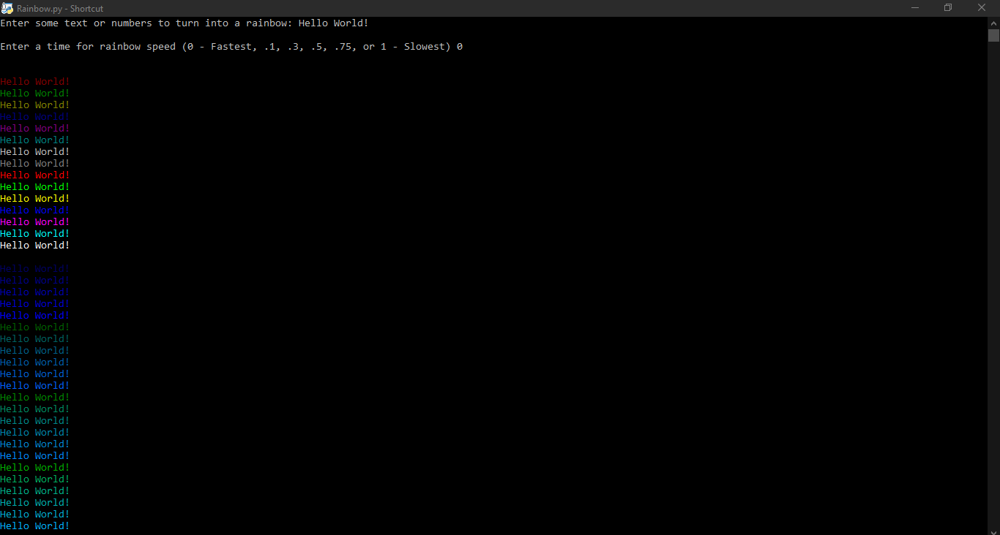

# IMPORTANT
- Must install the library called colored to use this program. You can install colored by using the command pip install colored
- If you do not have python installed, you can always download the .exe files and run them without having python installed

# DESCRIPTION
- This program allows the user to enter whatever text they want and it will convert the text into a rainbow! 

